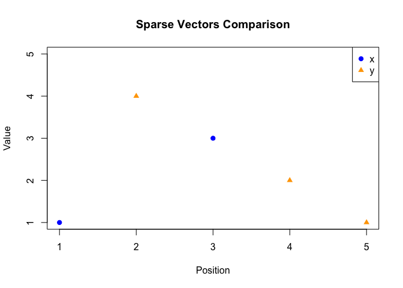

# Homework 6 R Package: Sparse Numeric Vector Class and Methods

# Description

`sparseMethods` provides an S4 class, `sparse_numeric`, for efficiently
storing numeric vectors by keeping only the nonzero entries and their
positions.

The package implements:

- Custom S4 class `sparse_numeric` for sparse vectors (`value`, `pos`,
  `length`)
- Arithmetic on sparse vectors: `+`, `-`, `*`
- Sparse functions:
  [`sparse_add()`](https://dananguyen18.github.io/sparseMethods/reference/sparse_add.md),
  [`sparse_sub()`](https://dananguyen18.github.io/sparseMethods/reference/sparse_sub.md),
  [`sparse_mult()`](https://dananguyen18.github.io/sparseMethods/reference/sparse_mult.md),
  [`sparse_crossprod()`](https://dananguyen18.github.io/sparseMethods/reference/sparse_crossprod.md)
- Vector summaries:
  [`mean()`](https://dananguyen18.github.io/sparseMethods/reference/mean.md),
  [`norm()`](https://dananguyen18.github.io/sparseMethods/reference/norm.md),
  [`standardize()`](https://dananguyen18.github.io/sparseMethods/reference/standardize.md)
- Visualization with
  [`plot()`](https://rdrr.io/r/graphics/plot.default.html)
- Custom printing via `show()`
- Full reference documentation generated using **roxygen2**
- Automated testing framework using **testthat**
- A **pkgdown** website for easy navigation and examples

This package successfully passes **R CMD check** with 0 errors, 0
warnings, and 0 notes and achieves 95% test coverage.

# Installation

You can install the development version of **sparseMethods** from GitHub
using:

``` r
# install.packages("devtools")
devtools::install_github("DanaNguyen18/sparseMethods")
#> Using GitHub PAT from the git credential store.
#> Skipping install of 'sparseMethods' from a github remote, the SHA1 (13c416c9) has not changed since last install.
#>   Use `force = TRUE` to force installation
```

## Example

This is a basic example showing you the methods.

``` r
library(sparseMethods)
#> 
#> Attaching package: 'sparseMethods'
#> The following objects are masked from 'package:base':
#> 
#>     mean, norm

# Create sparse vectors
x <- as(c(1, 0, 3, 0, 5), "sparse_numeric")
y <- as(c(0, 4, 0, 2, 1), "sparse_numeric")

# Print the sparse vectors
x
#> Here is an object of class 'sparse_numeric'
#> The length is  5Pos:Value 1 : 1, Pos:Value 3 : 3, Pos:Value 5 : 5
y
#> Here is an object of class 'sparse_numeric'
#> The length is  5Pos:Value 2 : 4, Pos:Value 4 : 2, Pos:Value 5 : 1

# Arithmetic
x + y
#> Here is an object of class 'sparse_numeric'
#> The length is  5Pos:Value 1 : 1, Pos:Value 2 : 4, Pos:Value 3 : 3, Pos:Value 4 : 2, Pos:Value 5 : 6
x - y
#> Here is an object of class 'sparse_numeric'
#> The length is  5Pos:Value 1 : 1, Pos:Value 2 : -4, Pos:Value 3 : 3, Pos:Value 4 : -2, Pos:Value 5 : 4
x * y
#> Here is an object of class 'sparse_numeric'
#> The length is  5Pos:Value 5 : 5

# Cross product (dot product)
sparse_crossprod(x, y)
#> [1] 5

# Means and norms
mean(x)
#> [1] 1.8
norm(x)
#> [1] 5.91608

# Standardization
standardize(x)
#> Here is an object of class 'sparse_numeric'
#> The length is  5Pos:Value 1 : -0.412568498503517, Pos:Value 2 : -0.928279121632914, Pos:Value 3 : 0.618852747755276, Pos:Value 4 : -0.928279121632914, Pos:Value 5 : 1.65027399401407

# Plot
plot(x, y)
```



``` r

# Show
show(x)
#> Here is an object of class 'sparse_numeric'
#> The length is  5Pos:Value 1 : 1, Pos:Value 3 : 3, Pos:Value 5 : 5
```

# PkgDown Website and License

The pkgDown website can be accessed at:
<http://dananguyen18.github.io/sparseMethods/>

This package is released under the MIT license.
